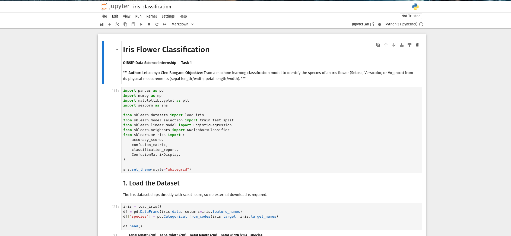

# 🌸 Iris Flower Classification


> **OIBSIP Data Science Internship — Task 1**
> Train a machine learning classification model to identify the species of an iris flower (*Setosa*, *Versicolor*, or *Virginica*) from its physical measurements.

**Author:** Letsoenyo Clen Bongane (#)

---

## 📑 Table of Contents
- [Overview](#-overview)
- [Tech Stack](#-tech-stack)
- [Dataset](#-dataset)
- [Approach](#-approach)
- [Visualizations](#-visualizations)
- [Results](#-results)
- [Best Model Selection](#-best-model-selection)
- [Files](#-files)
- [How to Run](#-how-to-run)

---

## 🔍 Overview

The Iris dataset is one of the most well-known benchmark datasets in machine learning — 150 flower samples, evenly split across three species, described by four measurements: sepal length, sepal width, petal length, and petal width. The goal here is to build and compare classifiers that predict species from those measurements alone.

## 🧰 Tech Stack

| Tool | Purpose |
|---|---|
| Python 3 | Core language |
| pandas / numpy | Data handling |
| scikit-learn | Models & evaluation metrics |
| matplotlib / seaborn | Visualization |
| Jupyter Notebook | Analysis environment |

## 📊 Dataset

Loaded directly from `sklearn.datasets.load_iris()` — no external download required.

| Property | Value |
|---|---|
| Samples | 150 |
| Features | 4 (all numeric) |
| Classes | 3 (Setosa, Versicolor, Virginica) |
| Class balance | 50 samples each |
| Missing values | None |

## 🛠 Approach

<details>
<summary><b>1. Exploratory Data Analysis</b></summary>
<br>

Shape, dtypes, null check, descriptive statistics, and class distribution confirmed a clean, perfectly balanced dataset requiring no preprocessing.
</details>

<details>
<summary><b>2. Visualization</b></summary>
<br>

Pairplot across all four features by species, plus boxplots per feature by species, to visually assess which measurements separate the classes best.
</details>

<details>
<summary><b>3. Feature Selection Discussion</b></summary>
<br>

Petal length and petal width showed the cleanest separation between species and are the most discriminative features. Sepal measurements are weaker on their own but still contribute useful signal — all four features were kept in the final model.
</details>

<details>
<summary><b>4. Train/Test Split</b></summary>
<br>

80/20 split, stratified by species, so each class is proportionally represented in both sets (120 train / 30 test).
</details>

<details>
<summary><b>5. Model Training & Evaluation</b></summary>
<br>

Two classifiers trained on all four features: **Logistic Regression** and **K-Nearest Neighbours (k=5)**. Evaluated on accuracy, confusion matrix, and full precision/recall/F1 classification reports.
</details>

## 🖼 Visualizations

<details>
<summary><b>Click to view: Boxplots by Species</b></summary>
<br>


</details>

<details>
<summary><b>Click to view: Pairwise Feature Relationships</b></summary>
<br>


</details>

<details>
<summary><b>Click to view: Confusion Matrices</b></summary>
<br>


</details>

## 📈 Results

| Model | Accuracy | Precision (avg) | Recall (avg) | F1-score (avg) |
|---|---|---|---|---|
| Logistic Regression | 96.67% | 0.97 | 0.97 | 0.97 |
| **K-Nearest Neighbours (k=5)** | **100%** | 1.00 | 1.00 | 1.00 |

## 🏆 Best Model Selection

<details>
<summary><b>Click to expand full reasoning</b></summary>
<br>

**KNN (k=5)** scored 100% accuracy on the held-out test set, while **Logistic Regression** scored 96.67%, missing one *versicolor* sample it classified as *virginica*.

With well-separated, low-dimensional data like Iris, a distance-based method like KNN can draw tighter decision boundaries around each species cluster than a linear model, which assumes classes are linearly separable — and *versicolor* vs. *virginica* isn't perfectly linear.

**Caveat:** with only 30 test samples, one flower going either way shifts accuracy by ~3.3%. This is a real result on this split, not proof KNN is categorically superior — a different `random_state` could flip the ranking. Logistic Regression remains a reasonable production choice regardless, given its interpretability and constant-time prediction cost.
</details>

## 📂 Files
DataScience-Task1-Iris/
├── iris_classification.ipynb # Full executed notebook
├── iris_classification.py # Source (VS Code # %% cell format)
├── screenshots/ # Visual evidence (plots, reports, confusion matrices)
└── README.md # This file


## ▶️ How to Run

```bash
python3 -m venv .venv
source .venv/bin/activate
pip install pandas numpy scikit-learn matplotlib seaborn jupyter
jupyter notebook iris_classification.ipynb
```

---

<p align="center"><i>Part of the OIBSIP Data Science Track — see the full <a href="../">OIBSIP repository</a> for other completed tasks.</i></p>